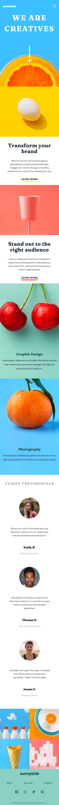

# Frontend Mentor - Sunnyside agency landing page solution

This is a solution to the [Sunnyside agency landing page challenge on Frontend Mentor](https://www.frontendmentor.io/challenges/sunnyside-agency-landing-page-7yVs3B6ef). Frontend Mentor challenges help you improve your coding skills by building realistic projects.

## Table of contents

- [Frontend Mentor - Sunnyside agency landing page solution](#frontend-mentor---sunnyside-agency-landing-page-solution)
  - [Table of contents](#table-of-contents)
  - [Overview](#overview)
    - [The challenge](#the-challenge)
    - [Screenshot](#screenshot)
      - [Mobile](#mobile)
      - [Desktop](#desktop)
      - [Tablet](#tablet)
    - [Links](#links)
  - [My process](#my-process)
    - [Built with](#built-with)
  - [Author](#author)

## Overview

### The challenge

Users should be able to:

- View the optimal layout for the site depending on their device's screen size
- See hover states for all interactive elements on the page

### Screenshot

#### Desktop

#### Mobile

#### Tablet

### Links
View my work here!

- Solution URL: [Frontend Mentor](https://www.frontendmentor.io/solutions/sunny-side-agency-landing-page-in-react-tailwind-and-css-grid-4ljbDyx2h)
- Live Site URL: [Netlify](https://fm-sunny-side-agency.netlify.app/)

## My process

### Built with

- [React](https://reactjs.org/) - JS library
- [TailwindCSS](https://tailwindcss.com/)
- Flexbox
- CSS Grid
- Mobile-first workflow

## Author

- Frontend Mentor - [@Amelss](https://www.frontendmentor.io/profile/Amelss)

